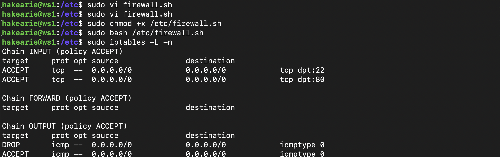
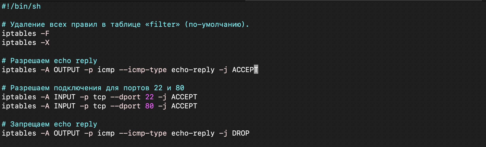
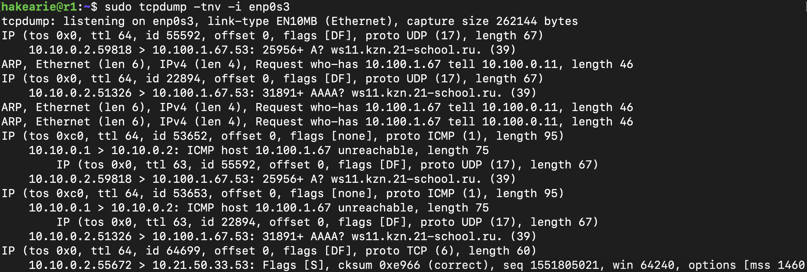

# Отчет о проделанной работе

## Цель работы
Основной целью выполнения данного проекта было изучение сетевых технологий в Linux, настройка IP-адресов, статическая маршрутизация, тестирование скорости соединения и работа с сетевыми экранами. В ходе работы были выполнены задания по использованию утилит ipcalc, iperf3, iptables, nmap, а также настройке маршрутизации между виртуальными машинами.

---

### Part 1. Инструмент **ipcalc**

1. ***Сети и маски***
    - Адрес сети *192.167.38.54/13*:
        - `ipcalc 192.167.38.54/13`

    
    - Перевод маски *255.255.255.0* в префиксную и двоичную запись:
        - `ipcalc 192.0.2.0/24`
 
    
    - Перевод маски */15* в обычную и двоичную:
        - `ipcalc 192.0.2.0/15`
    
    
    - Перевод маски *11111111.11111111.11111111.11110000* в обычную и префиксную:
        - `ipcalc 192.0.2.0/28`
    
    
2. ***localhost***
    - IP-адрес *194.34.23.100* и *128.0.0.1* не отвечают на пинг. Это может означать, что узлы с этими IP-адресами не доступны или не существуют.

    
    
    
    
    - IP-адреса *127.0.0.2* и *127.1.0.1* успешно отвечают на пинг. Это означает, что они доступны. Эти IP-адреса принадлежат специальному диапазону *127.0.0.0/8*, который зарезервирован для loopback адресов. Loopback адреса используются для тестирования сетевого соединения на локальной машине.

    

    
3. ***Диапазоны и сегменты сетей***
    - Ниже перечислнные IP адреса можно использовать в качестве публичного:
        - *134.43.0.2*

        
        - *172.0.2.1*

        
        - *192.172.0.1*

        
        - *172.68.0.2*

        
        - *192.169.168.1*

        
    - Ниже перечислнные IP адреса можно использовать в качестве частного:
        - *10.0.0.45*

        
        - *192.168.4.2*

        
        - *172.20.250.4*

        
        - *172.16.255.255*

        
        - *10.10.10.10*

        
    - Какие из перечисленных IP адресов шлюза возможны у сети *10.10.0.0/18*: *10.0.0.1*, *10.10.0.2*, *10.10.10.10*, *10.10.100.1*, *10.10.1.255*?
        - Через команду `ipcalc 10.10.0.0/18` получаем минимальный адрес хоста в сети: *10.10.0.1* и максимальный адрес хоста в сети: *10.10.63.254*.
        
        
        
        
        - Таким образом, из перечисленных IP-адресов в качестве адреса шлюза могут быть использованы следующие:
            - *10.10.0.2*
            - *10.10.10.10*
            - *10.10.1.255*
        - Остальные IP-адреса (*10.0.0.1* и *10.10.100.1*) находятся вне диапазона сети, поэтому они не могут быть использованы в качестве адреса шлюза для сети *10.10.0.0/18*.

### Part 2. Статическая маршрутизация между двумя машинами

1. С помощью команды `ip a` вывел существующие сетевые интерфейсы.
    - *ws1*
    
    - *ws2*
    
2. Описал сетевой интерфейс, соответствующий внутренней сети, на обеих машинах и задал следующие адреса и маски:
    - *ws1* - *192.168.100.10*, маска */16*
    
    - *ws2* - *172.24.116.8*, маска */12*.
    
3. Вызов команды `netplan apply` для перезапуска сервиса сети.
    - *ws1*
    
    - *ws2*
    
4. Добавил статический маршрут от одной машины до другой и обратно при помощи команды `ip r add` и пропинговал `ping` соединение между машинами.
    - *ws1*
    
    - *ws2*
    
    
5. Добавил статический маршрут от одной машины до другой с помощью файла etc/netplan/00-installer-config.yaml.
    - *ws1*
    
        - *ping -c 4 172.24.116.8*
        
    - *ws2*
    
        - *ping -c 4 192.168.100.10*
        

### Part 3. Утилита **iperf3**

1. Скорость соединения.
    - 8 Mbps в MB/s:
        - 1 бит = 0.125 байт (потому что 1 байт = 8 бит)
        - 8 Mbps = 8 * 0.125 MB/s = 1 MB/s
    - 100 MB/s в Kbps:
        - 1 байт = 8 бит
        - 1 МБ = 1024 КБ
        - 100 MB/s = 100 * 8 * 1024 Kbps = 819200 Kbps
    - 1 Gbps в Mbps:
        - 1 Гбит = 1024 Мбит
        - 1 Gbps = 1024 Mbps
2. Утилита `iperf3`
    - на машине ws1 запускаем команду `iperf3 -s` для запуска  `iperf3` в режиме сервера. Сервер начинает слушать входящие соединения от клиентов iperf3. Это означает, что сервер ожидает запросов от клиентов.
    
    - на машине ws2 запускаем команду `iperf3 -c 192.168.100.10`, клиент начинает подключаться к серверу iperf3, который слушает на IP-адресе 192.168.100.10. Это означает, что клиент будет отправлять данные на сервер для измерения пропускной способности соединения.
    

### Part 4. Сетевой экран

1. Утилита `iptables`
    - ws1
        - На ws1 применил стратегию, когда в начале пишется запрещающее правило, а в конце пишется разрешающее правило.
        - Открыл на машинах доступ для порта 22 (ssh) и порта 80 (http).
        - Запретил echo reply (машина не должна «пинговаться», т.е. должна быть блокировка на OUTPUT).
        
        
        - Запустил файлы командами `chmod +x /etc/firewall.sh` и `sh /etc/firewall.sh`.
        - Команда `iptables -L -n` используется для отображения всех текущих правил iptables в числовом формате. Здесь:
            - iptables `-L` отображает все текущие правила iptables.
            - Флаг `-n` выводит все IP-адреса и порты в числовом формате, что ускоряет вывод, поскольку не требуется преобразование имени хоста.

            
    - ws2
        - На ws2 применил стратегию, когда в начале пишется разрешающее правило, а в конце пишется запрещающее правило.
        - Открыл на машинах доступ для порта 22 (ssh) и порта 80 (http).
        - Разрешил echo reply (машина должна «пинговаться»).
        
        - Запустил файлы командами `chmod +x /etc/firewall.sh` и `sh /etc/firewall.sh`.
        - Команда `iptables -L -n` используется для отображения всех текущих правил iptables в числовом формате. Здесь:
            - iptables `-L` отображает все текущие правила iptables.
            - Флаг `-n` выводит все IP-адреса и порты в числовом формате, что ускоряет вывод, поскольку не требуется преобразование имени хоста.
            
            
2.  Утилита `nmap`
    - ws1
        - `ping -c 4 172.24.116.8`, так как на машине ws2
        разрешил `echo reply` (машина должна «пинговаться»)
        
    - ws2 
        - `ping -c 4 192.168.100.10`, так как на машине ws1 запретил `echo reply` (машина не должна «пинговаться», т.е. должна быть блокировка на OUTPUT).
          
    - Вывод команды `nmap -sn` 
        - `-sn` этот флаг говорит nmap выполнить “Ping scan”. “Ping scan” — это процесс, при котором nmap отправляет ICMP Echo Request (или “ping”) на указанный IP-адрес и ожидает ответа. Если хост отвечает на запрос, то nmap сообщит, что хост работает123.
        - ws2 `nmap -sn 192.168.100.10` 
        
        - ws1 `nmap -sn 172.24.116.8`
           

### Part 5. Статическая маршрутизация сети

1. Настройка адресов машин. Настрой конфигурации машин в `etc/netplan/00-installer-config.yaml` согласно сети на рисунке.
    
      
    
    - ws11
     
    - ws22
     
    - w21
     
    - r1
     
    - r2
     
    - Пропинговал ws22 c ws21
     
    - Пропинговал r1 с ws11
     
2.  Включение переадресации IP-адресов
    - Выполнил команду `sysctl -w net.ipv4.ip_forward=1` на роутерах:
        - r1
         
        - r2
         
    - Открыл файл `/etc/sysctl.conf` и добавил в него следующую строку: `net.ipv4.ip_forward = 1`
     
3. Установка маршрута по-умолчанию
    - Настроил маршрут по-умолчанию (шлюз) для рабочих станций. Для этого добавил `default` перед IP роутера в файле конфигураций.
        - ws11
         
        - ws21
         
        - ws22
        
    - Вывод команда `ip r`, где показано, что добавился маршрут в таблицу маршрутизации.
        - ws11
        
        - ws21
        
        - ws22 
        
    - Пропинговал с ws11 роутер r2 и показал на r2, что пинг доходит. Для этого использовал команду `tcpdump -tn -i enp0s10`
        - на ws11 выполнил `ping 10.100.0.12`
        
        - после этого на r2  выполнил команду `tcpdump -tn -i enp0s10`
        
4. Добавление статических маршрутов
    - Добавил в роутеры r1 и r2 статические маршруты в файле конфигураций:
        - r1
        
        - r2
        
    - Выполнил команду `ip r` и показал таблицу с маршрутами на обоих роутерах.
        - r1
        
        - r2
        
    - Запустил команды на ws11:
        - `ip r list 10.10.0.0/18`
        
        - `ip r list 0.0.0.0/0`
        
        - *10.10.0.0/18* был выбран маршрут, отличный от *0.0.0.0/0*, хотя он попадает под маршрут по умолчанию связано с тем, как работает таблица маршрутизации в Linux. Когда пакет нуждается в маршрутизации, Linux проверяет таблицу маршрутизации и выбирает маршрут, который наиболее точно соответствует IP-адресу назначения пакета. Если есть маршрут, который точно соответствует подсети *10.10.0.0/18*, то он будет выбран вместо маршрута по умолчанию 0.0.0.0/0, даже если IP-адрес назначения пакета также попадает под маршрут по умолчанию. Это потому, что более специфический маршрут всегда имеет приоритет перед более общим маршрутом.
5.  Построение списка маршрутизаторов
    - Выполнил команду `tcpdump -tnv -i enp0s3`на r1
    
    
    -  При помощи утилиты `traceroute` построил список маршрутизаторов на пути от ws11 до ws21.
    
    - Машина ws11 отправляет серию сообщений к другой машине ws21. Каждое сообщение имеет TTL (Time To Live), который изначально равен 1 и увеличивается на 1 с каждым новым сообщением. Когда сообщение проходит через маршрутизатор, маршрутизатор уменьшает TTL на 1. Если TTL достигает 0, маршрутизатор “уничтожает” сообщение и отправляет обратно сообщение о том, что время жизни истекло. Traceroute использует эти обратные сообщения, чтобы узнать, через какие маршрутизаторы прошло сообщение на пути к целевому компьютеру.В выводе мы видим серию сообщений с разными значениями TTL (от 1 до 18), что указывает на то, что сообщение прошло через 18 разных маршрутизаторов на пути к целевому компьютеру.
6.  Использование протокола ICMP при маршрутизации
    - Запустил на r1 перехват сетевого трафика, проходящего через enp0s3 с помощью команды `tcpdump -n -i eth0 icmp`
    
    - Пропинговал с ws11 несуществующий IP (например, 10.30.0.111) с помощью команды `ping -c 1 10.30.0.111`
    

### Part 6. Динамическая настройка IP с помощью DHCP

1.  Указал адрес маршрутизатора по-умолчанию, DNS-сервер и адрес внутренней сети для машины r2 в файле `/etc/dhcp/dhcpd.conf`.
    - 
2.  В файле `resolv.conf` прописал ` nameserver 8.8.8.8`.

    - Машину ws21 перезагрузил при помощи `reboot` и через `ip a` показал что она получила адрес.
    
    - Пропинговал ws22 с ws21
    
    - Указал MAC адрес у ws11, для этого в etc/netplan/00-installer-config.yaml добавил строки: `macaddress: 10:10:10:10:10:BA, dhcp4: true`.
    
    - Для r1 настроил аналогично r2,сделал выдачу адресов с жесткой привязкой к MAC-адресу (ws11).
    
    - Выполнил команду `dhclient -r` и `dhclient` это приведет к тому, что DHCP-клиент на ws21 освободит текущий IP-адрес и запрос новый у DHCP-сервера. Команда `ip a` в выводе показала,что получен новый IP-адрес на машине ws21.
    
3.  В этом разделе использовал следующие опции DHCP:
    - `range`: Эта опция определяет диапазон IP-адресов, которые DHCP-сервер может выдавать клиентам.
    - `option routers`: Эта опция указывает на IP-адрес маршрутизатора по умолчанию, который будет использоваться клиентами.
    - `option domain-name-servers`: Эта опция указывает на IP-адрес DNS-сервера, который будет использоваться клиентами.
    - `host и hardware ethernet`: Эти опции используются для создания статической привязки IP-адреса к MAC-адресу.

### Part 7. **NAT**
1. В файле /etc/apache2/ports.conf на ws22 и r1 изменил строку Listen 80 на Listen 0.0.0.0:80, то есть сделай сервер Apache2 общедоступным.
    - ws22
    
    - r1
    
2. Запустил веб-сервер Apache командой `service apache2 start` на ws22 и r1.
    - ws22
    
    - r1
    
3. Добавил в фаервол на r2 следующие правила:
    - Удаление правил в таблице filter - `iptables -F`.
    - Удаление правил в таблице "NAT" - `iptables -F -t nat`.
    - Отбрасывать все маршрутизируемые пакеты - `iptables --policy FORWARD DROP`.
    
    - Проверил соединение между ws22 и r1 командой `ping`.Как ожидалось ws22 не должна «пинговаться» с r1.
    
    - Добавил в скрипт `/etc/firewall.sh` еще одно правило: разрешил маршрутизацию всех пакетов протокола ICMP.
    
    После запуска скрипта с этими правилами, ws22 «пингуется» с r1.
    
4. Добавил дополнительно еще два правила:
    - Добавил SNAT, а именно маскирование всех локальных ip из локальной сети, находящейся за r2
    - Добавил DNAT на 8080 порт машины r2 и добавить к веб-серверу Apache, запущенному на ws22, доступ извне сети.
    
    - Проверил соединение по TCP для SNAT: для этого с ws22 подключиться к серверу Apache на r1 командой: `telnet 10.100.0.11 80`.
    
    - Проверь соединение по TCP для DNAT: для этого с r1 подключиться к серверу Apache на ws22 командой `telnet 10.100.0.12 8080`.
    
    
### Part 8. Дополнительно. Знакомство с **SSH Tunnels**

1. Запустил веб-сервер Apache на ws22 только на localhost.

2. Воспользовался Local TCP forwarding с ws21 до ws22, чтобы получить доступ к веб-серверу на ws22 с ws21.

3. Воспользовался Remote TCP forwarding c ws11 до ws22, чтобы получить доступ к веб-серверу на ws22 с ws11.

---

## Вывод
В результате выполнения проекта я:
- Освоил работу с утилитами ipcalc, iperf3, iptables и nmap.
- Получил практические навыки настройки IP-адресов и маршрутизации.
- Изучил основы фильтрации трафика с iptables.
- Научился анализировать и тестировать сетевые соединения.

Проект дал возможность закрепить знания по сетям и Linux, что является важным навыком для системного администрирования и DevOps-инженерии.

